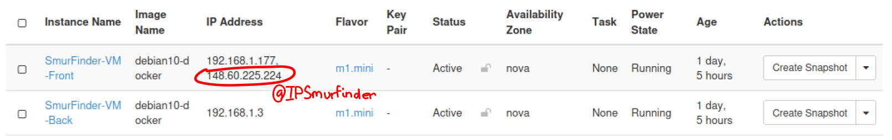

# SmurFinder

## Auteurs
- Quéméneur Katell
- Cordier Maxime

## Informations
SmurFinder est une application web qui a pour but d'offrir aux utilisateurs un dictionnaire de Schtroumpfs (The Smurfs en anglais). Cette application est déployée grâce au principe de contenerisation tel que Docker. Dans le cadre du module Cloud de la formation IAI de l'ENSSAT cette application doit également être déployée sur un Cloud. Dans notre cas, nous utilisons la solution open source nommée OpenStack. 

## Architecture du projet
L'application est divisée en 2 parties : frontend & backend. Chaque partie est déployée sur son instance dédiée. *SmurFinder-VM-Front* pour le frontend et *SmurFinder-VM-Back* pour le backend. La partie front va lancer l'initialisation de la base de données en ajoutant des Schtroumpfs au travers d'une requête (cf fonction *addSmurfs* du fichier *index.js*). 

## Pré-requis
- Environnement OpenStack

## Comment déployer le projet ? 
1. Identifiez le fichier *smurfinder_template.yaml* dans le répertoire HotTemplate.
1. ***(Optionel)*** Modifier les paramètres d'environnement dans le fichier *smurfinder_template_env.yml*
1. Connectez-vous sur OpenStack.
1. Cliquez sur le menu ***Orchestration*** puis sur ***Stack**.
1. Déployez une nouvelle stack en cliquant sur ***Launch Stack***.
1. Renseignez le 'Template source' (='File') et le "Template file" (='smurfinder_template.yaml').
1. Cliquez sur *Next* pour lancer la stack.
1. Retenez l'adresse IP du service. Cliquez sur le menu ***Network*** puis sur ***Floatings IP***. L'adresse IP (@IPSmurfinder) du service SmurFinder correspond à celle associée à la machine virtuelle front. 

1. Dans un moteur de recherche, renseignez l'URL suvante : *http://@IPSmurfinder*